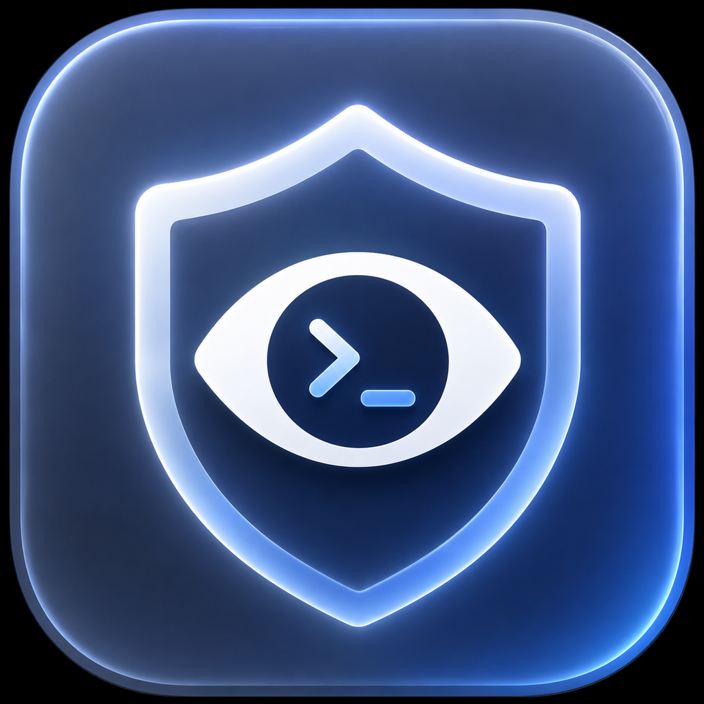
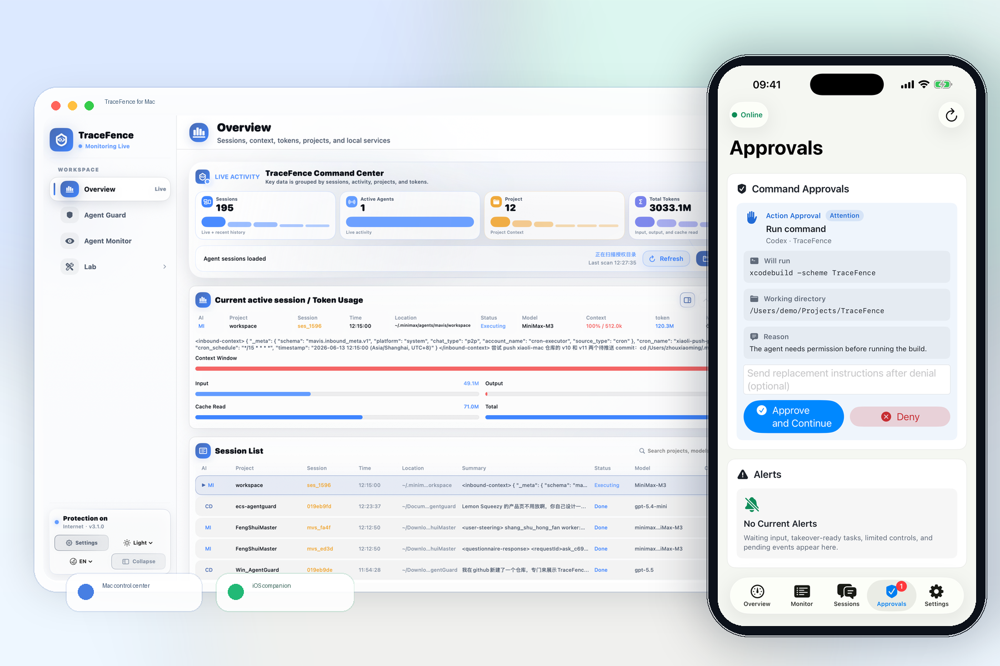
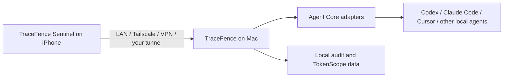

<p align="center">
  
</p>

<h1 align="center">TraceFence</h1>

<p align="center"><strong>Control Codex, Claude Code, Cursor, Gemini CLI, and other Mac AI agents from your iPhone over your own network.</strong></p>

<p align="center">
  <a href="https://tracefence.com/">Website</a> ·
  <a href="https://tracefence.com/go/mac-local">Download for Mac</a> ·
  <a href="https://tracefence.com/go/ios-testflight">iOS TestFlight</a> ·
  <a href="https://tracefence.com/go/standard-monthly">Standard subscription</a> ·
  <a href="support.html">Support</a>
</p>



TraceFence turns your iPhone into a local control surface for AI coding agents running on your Mac. Approve or deny requests, launch and resume sessions, interrupt unsafe runs, and inspect agent context without routing your work through a TraceFence cloud relay.

This repository is the official public home for signed macOS installers, checksums, product documentation, support pages, and legal documents. Application source code is not published in this repository.

## What TraceFence does

- **iPhone control for Mac agents**: use TraceFence Sentinel to supervise work away from the keyboard.
- **Permission approvals**: review the command, working directory, and reason before approving or denying a supported request.
- **Session control**: launch, relaunch, interrupt, resume, or terminate when the selected adapter exposes that capability.
- **Multi-agent visibility**: keep supported agent sessions, status, context, and token usage in one Mac control center.
- **Local-first networking**: connect over LAN, Tailscale, VPN, or a tunnel you operate. TraceFence does not provide a cloud relay for agent traffic.
- **Local audit and analytics**: review Agent Guard events and TokenScope usage on your Mac.

## Supported agents

TraceFence Agent Core currently includes adapters for:

| Agent family | Examples |
| --- | --- |
| OpenAI | Codex Desktop, Codex CLI |
| Anthropic | Claude Code |
| IDE and CLI agents | Cursor Agent, Gemini CLI, Grok CLI, Qwen Code, OpenCode, MiniMax Code |
| Additional adapters | OpenClaw, Hermes, Kiro, Aider, Amp, Goose, GitHub Copilot CLI, Factory/Droid, CodeBuddy, Trae |

Control depth depends on the local CLI, hook, and adapter. TraceFence only shows control actions that the Mac reports as available; display-only integrations stay read-only.

## Install

### macOS local build (recommended)

Download the latest notarized Apple Silicon DMG from [GitHub Releases](https://github.com/AI-Scarlett/TraceFence/releases/latest). GitHub builds receive feature updates and bug fixes first.

```bash
brew tap AI-Scarlett/tap
# Homebrew 6 and later require explicit trust for third-party casks.
brew trust --cask AI-Scarlett/tap/tracefence
brew install --cask tracefence
```

Requirements: Apple Silicon Mac running macOS 13 or later. Homebrew versions before 6 can skip the `brew trust` line.

### iPhone companion

Install [TraceFence Sentinel through TestFlight](https://testflight.apple.com/join/yZTXmaJ8), then pair it with the Mac app. Remote access uses your LAN, Tailscale, VPN, or another tunnel you control.

### Mac App Store build

A store-signed build remains available from the [Mac App Store](https://tracefence.com/go/mac-app-store). For the newest TraceFence features and fixes, use the GitHub local build.

## How the connection works



Agent traffic goes directly between your iPhone and paired Mac over the network path you choose. There is no TraceFence account or TraceFence-hosted relay in that path.

## Standard subscription

TraceFence Standard unlocks iPhone remote control, supported approvals and session actions, TokenScope analytics, and Agent Guard local audit workflows.

- Monthly: **US$9.99**
- Annual: **US$79.99**

[Choose monthly](https://tracefence.com/go/standard-monthly) or [choose annual](https://tracefence.com/go/standard-annual).

## Verify a download

Each current DMG release includes a SHA-256 checksum. The macOS app is signed with a Developer ID and notarized by Apple.

```bash
shasum -a 256 TraceFence-*.dmg
spctl --assess --type open --context context:primary-signature --verbose TraceFence-*.dmg
```

## Documentation and support

- [Product overview](docs/product-overview.md)
- [Installation guide](docs/support/install.md)
- [Privacy and data](docs/privacy-and-data.md)
- [FAQ](docs/support/faq.md)
- [Support center](support.html)
- [Privacy policy](privacy-policy.html)
- [Terms of service](terms-of-service.html)

For bugs and compatibility reports, [open a GitHub issue](https://github.com/AI-Scarlett/TraceFence/issues) and include your macOS version, TraceFence version, affected agent, and whether the integration was shown as controllable or read-only.
